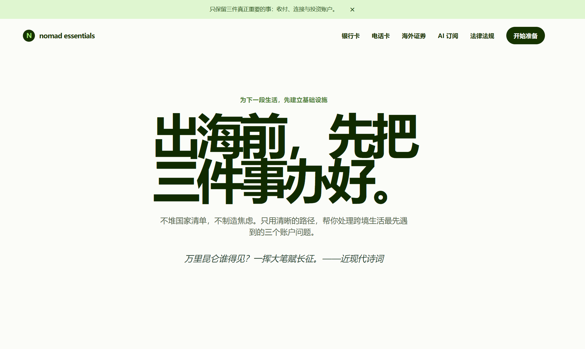

# 🌏 Digital Nomad CN

## 中国数字游民出海实用指南

> 面向中文用户的海外生活、远程工作与出海工具信息站。


---

## 🌐 在线访问

👉 https://kfat77.github.io/digital-nomad-cn/


---

## 📸 网站预览

<!-- 网站截图放这里 -->




---

## 📖 项目介绍

Digital Nomad CN 是一个面向中国用户的数字游民信息整理网站。

目标是帮助用户更方便地了解海外生活相关信息，包括：

- 💳 海外银行卡与支付工具
- 📱 海外电话卡与 eSIM
- 📈 海外金融工具与证券平台信息
- 🌍 出境生活资料整理


---

## ✨ 内容模块


### 💳 海外银行卡

整理海外银行卡相关信息：

- 开户条件
- 使用场景
- 注意事项


### 📱 全球通信

整理：

- 海外电话卡
- eSIM 服务
- 网络连接方案


### 📈 海外金融工具

整理：

- 海外金融平台信息
- 基础资料整理
- 使用注意事项


### 🌍 出海生活指南

整理：

- 国家与地区信息
- 长期居住参考
- 数字游民相关资料


---

## 📂 项目结构


```text
digital-nomad-cn

├── docs/          网站页面
├── articles/      内容文章
├── datasets/      数据文件
├── scripts/       自动化脚本
├── tests/         测试文件
└── README.md
```


---

## 🚀 本地运行


启动网站：

```powershell
python -m http.server 4173 --directory docs
```


访问：

```
http://localhost:4173
```


---

## 🔍 项目检查


运行：

```powershell
node scripts/check-site.mjs
```


---

## 🤝 参与贡献


欢迎：

- 提交 Issue
- 提供内容建议
- 改进网站功能


GitHub：

https://github.com/kfat77/digital-nomad-cn


---

## ⚠️ 免责声明


本站内容仅用于信息整理和学习参考。

涉及开户、投资、税务、法律等事项，请以相关机构官方网站及所在地最新规则为准。