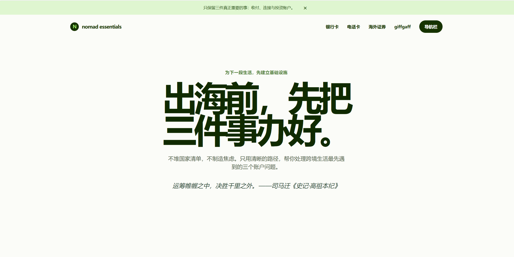

# Nomad Essentials · 出海基础准备

面向中文用户的跨境生活基础设施指南。网站聚焦真正影响出发体验的三件事：收付、连接与投资账户；用清晰的工具目录替代信息焦虑。

[](https://kfat77.github.io/digital-nomad-cn/)

## 在线访问

<https://kfat77.github.io/digital-nomad-cn/>

## 首页预览



## 目前包含

- 银行卡：跨境收付、多币种资金管理与海外支付工具。
- 电话卡：号码、保号、漫游与 eSIM 方案；包含 giffgaff 电话卡的介绍、下单和物流查询入口。
- 海外证券：海外投资服务的信息整理与合规提醒。
- AI 订阅：常见订阅方式与风险提示。
- 法律法规：跨境资金、税务与投资相关的官方资料入口。
- 社区论坛：匿名分享跨境生活经验、按主题浏览讨论。

网站右上角的“导航栏”收纳 AI 订阅、法律法规和社区论坛；电话卡下单页提供 Telegram 客服联系入口。

## 项目结构

```text
digital-nomad-cn/
├── docs/                 # GitHub Pages 站点文件
│   ├── phone-cards/      # giffgaff 电话卡介绍、下单与查询
│   ├── community.html    # 社区论坛页面
│   └── legal.html        # 法律法规页面
├── supabase/             # 订单与社区论坛的数据库脚本
├── scripts/              # 数据和站点检查脚本
└── README.md
```

## 本地运行

```powershell
python -m http.server 4173 --directory docs
```

然后访问 <http://localhost:4173>。

## 社区论坛初始化

首次启用社区论坛时，在对应 Supabase 项目的 SQL Editor 中执行 [`supabase/community.sql`](./supabase/community.sql)。该脚本会创建匿名发帖需要的表与安全 RPC 接口。

## 检查

```powershell
node scripts/check-site.mjs
```

## 参与贡献

欢迎通过 Issue 提供工具建议、内容修正或使用经验。所有涉及开户、投资、税务与法律的内容，请以相关机构的最新官方说明为准。
